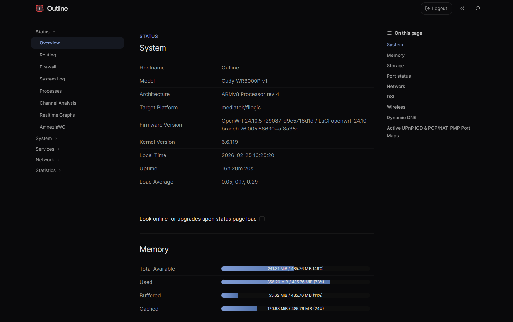
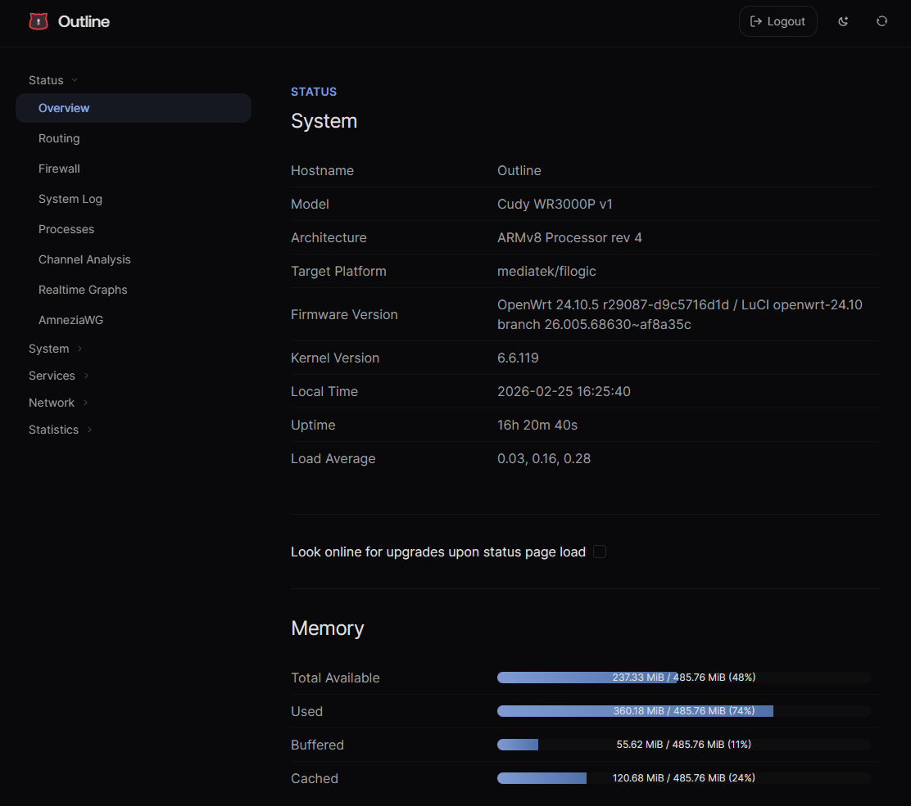
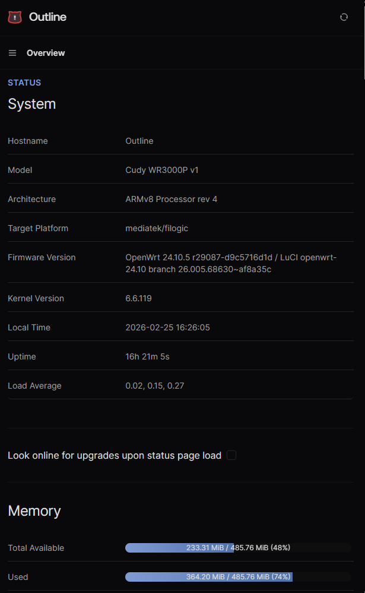

# Outline Theme

A modern OpenWrt LuCI theme. Fork of [luci-theme-aurora](https://github.com/eamonxg/luci-theme-aurora) with a massive visual overhaul.

Heavily inspired by [Claude Code docs](https://docs.anthropic.com/en/docs/claude-code), [Mintlify](https://mintlify.com) documentation layouts, and [21st.dev sign-in components](https://21st.dev/community/components/erikx/sign-in-flow-1/default).

## Preview

| Desktop | Tablet | Phone |
|---------|--------|-------|
|  |  |  |

https://github.com/user-attachments/assets/d3701be2-686f-48ec-b569-c7113755dba5

## Compatibility

- **OpenWrt** 23.05+
- **Chrome/Edge** 111+
- **Safari** 16.4+
- **Firefox** 128+

## Installation

OpenWrt 25.12+ and snapshots use `apk`; earlier versions use `opkg`.

**opkg** (OpenWrt &lt; 25.12):

```sh
cd /tmp && uclient-fetch -O luci-theme-outline.ipk \
  https://github.com/tickcount/luci-theme/releases/latest/download/luci-theme-outline_0.11.0-r20260208_all.ipk \
  && opkg install luci-theme-outline.ipk
```

**apk** (OpenWrt 25.12+):

```sh
cd /tmp && uclient-fetch -O luci-theme-outline.apk \
  https://github.com/tickcount/luci-theme/releases/latest/download/luci-theme-outline-0.11.0-r20260208.apk \
  && apk add --allow-untrusted luci-theme-outline.apk
```

## Development

Built with **Vite 7**, **Tailwind CSS v4**, and **pnpm**. See [Development docs](.dev/docs/DEVELOPMENT.md).

## License

Apache License 2.0. Based on [luci-theme-aurora](https://github.com/eamonxg/luci-theme-aurora) by eamonxg.
